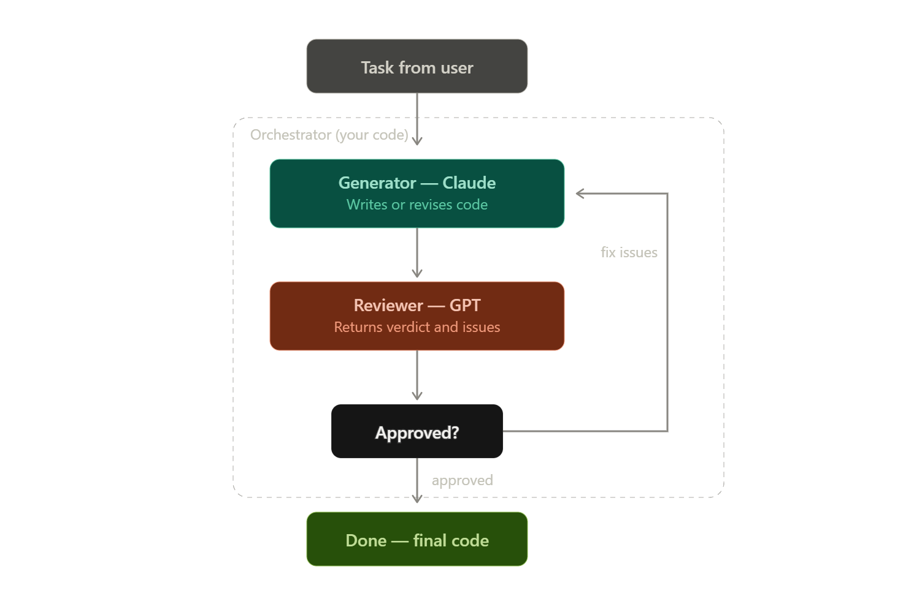
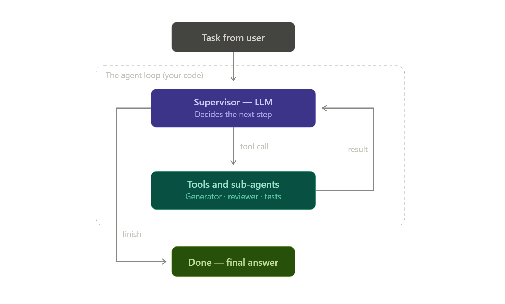

What the orchestrator actually is

An orchestrator is a coordination layer that owns three things the models can't own themselves: state (the canonical current artifact — the latest version of the code — plus the history of what's happened), routing (deciding who gets called next and what exactly goes into their prompt), and termination (deciding when the whole thing stops). Everything else is just API calls.

There are two flavors worth distinguishing. In a code-driven orchestrator, the control flow is deterministic — a loop or state machine you wrote, like your example. In an LLM-driven orchestrator (the "supervisor" pattern), a third model decides at each step which agent to invoke, usually via tool calls. Start with the first one. It's debuggable, predictable, cheap, and covers your scenario completely.

How one round works, concretely

The orchestrator sends the task to the generator with a system prompt like "You are a senior C# engineer. Output only the complete code, no commentary." It gets code back and stores it as the canonical artifact. Then it builds a fresh prompt for the reviewer containing the original task plus that code, with a system prompt that demands a structured verdict — strict JSON like {"approved": false, "issues": ["TruncateAt throws on null input", "off-by-one at the word boundary"]}. This part is the load-bearing trick: your loop needs to branch on the verdict, and you can't reliably branch on prose like "looks pretty good overall, though...". Structured output turns a fuzzy model opinion into a boolean your if statement can use.

If approved is false, the orchestrator constructs the next generator prompt: original task + current code + the issue list, framed as "revise the code to address these issues; output only the complete revised code." Notice that each model call gets only what it needs — not the entire conversation transcript. The orchestrator curates context deliberately, which keeps costs flat and prevents the models from drowning in their own history as rounds accumulate.

The part everyone underestimates: knowing when to stop

"Until the two AIs agree that everything is OK" is the naïve termination condition, and on its own it fails in two opposite ways. Reviewers can be sycophantic (approving too early because LLMs are agreeable) or perfectionist (inventing ever-smaller nitpicks forever, or oscillating — fix A, break B, fix B, break A). So a real orchestrator stacks several stop conditions: approval from the reviewer, a hard cap on rounds (3–5 is the sweet spot; quality gains flatten fast after that), a no-progress check (if the same issues come back twice in a row, more rounds won't help), and optionally a token/cost budget.

The single biggest upgrade over "two AIs agree" is adding an objective signal: have the orchestrator actually run dotnet build and dotnet test on the generated code and feed compiler errors or test failures back into the loop as ground truth. Model-vs-model agreement is a weak signal — both can be confidently wrong together. Execution feedback is a strong signal, and it's precisely what your orchestrator (being real code on a real machine) can provide that neither model can.

Instructions for building one

The recipe, end to end: define the two roles as system prompts, with the reviewer contractually bound to JSON output. Write the loop — generate, review, branch on verdict, feed issues back — with maxRounds and the no-progress guard. Keep the orchestrator as the single owner of the canonical code string; the models are stateless functions you call. Log every round to the console or a file, because when the loop misbehaves you'll want to read the actual prompts that were sent. Once that works, bolt on compile/test execution as a second reviewer that can't be sweet-talked.

I've written you a complete, minimal working example in C# — a single-file console app that runs exactly your scenario (Claude generates, GPT reviews as strict JSON, loop until approved or budget exhausted), with the no-progress guard included:

Created a file, read a file
Created a file, read a file

The file is a complete dotnet run-able console app — raw HttpClient calls with no SDK, deliberately, so the mechanics are fully visible: the orchestrator is ~40 lines, and each "agent" is just a class that builds a prompt, POSTs it, and parses the response.

Two closing notes on where this pattern goes next. First, variants: your loop is the evaluator–optimizer topology, but the same orchestrator skeleton supports pipelines (A's output feeds B feeds C, no loop), parallel fan-out (several generators attempt the task, a judge picks the best), and supervisor/worker (an LLM routes tasks to specialists via tool calls). Second, frameworks: once you outgrow the hand-rolled loop, the natural home in your stack is Microsoft's Agent Framework (the successor unifying Semantic Kernel and AutoGen, with first-class C# support and built-in group-chat and handoff orchestration patterns). But I'd genuinely build the raw version first — it teaches you exactly what the frameworks are abstracting, and for a two-agent loop the abstraction often costs more than it saves.

If you want, I can extend the example with the dotnet build/dotnet test execution step as a second, un-sweet-talkable reviewer — that's the change that turns this from a demo into something production-worthy.

----------------------------------------------------------------------------------------------

The mechanism: tool use

The whole pattern rides on one API feature. When you call the supervisor model, you pass along a set of tool definitions — each one a name, a natural-language description, and a JSON Schema for its arguments. Instead of replying with text, the model can reply with a tool_use block: structured intent like {name: "review_code", input: {}}. Your runtime loop pattern-matches on that, executes the corresponding function, appends a tool_result message to the transcript, and calls the model again with the grown transcript. That transcript is the supervisor's working memory — it's how the model "remembers" that it already generated once, that the review found two issues, and that it's now mid-revision. The loop ends when the model calls a finish tool (or answers in plain text, or hits your hard caps).

So where last time the state machine was explicit in your code, here the state lives in a conversation transcript and the transitions live in a model's judgment. That's the entire difference.

Sub-agents are just tools

From the supervisor's point of view there's no difference between a tool that runs dotnet test and a tool that secretly contains an entire other LLM. Your review_code tool wrapper internally calls GPT with its own reviewer system prompt — the supervisor neither knows nor cares. This uniform interface is what makes the pattern composable: specialists, scripts, databases, and other agents all look identical to the router.

It also enables the most important optimization: the artifact store. The generated code never enters the supervisor's transcript. It lives in your runtime's state (a plain field), and tools return short summaries instead — "code written, 42 lines" or the reviewer's compact JSON verdict. The supervisor routes on verdicts without ever reading a line of code. That's deliberate context isolation: workers see details in their own throwaway contexts, the supervisor keeps a cheap high-level view, and your token bill stays flat instead of ballooning as the transcript replays the full code every round.

When to use it — and when not to

Reach for an LLM supervisor when the path genuinely can't be known in advance: the number of steps varies per task, there are many specialists and picking the right one requires understanding the request, or user inputs are open-ended ("sometimes it needs research first, sometimes refactoring, sometimes just a review"). Your generator–critic scenario from last time does not need this — the path is fixed, so the coded loop is cheaper, faster, deterministic, and testable. The honest rule (it's Anthropic's own published guidance on building agents, and it holds up): use the simplest control flow that solves the problem, and promote to the model only the decisions that actually require judgment. Hybrids are common and good — a supervisor picks which pipeline to run, and each pipeline is a boring deterministic workflow inside.

The costs you accept with the supervisor: nondeterminism (same input, different tool sequences), extra latency (a model call between every step), a growing transcript, and harder testing and debugging.

Instructions for building one

Start with the tool set, because the tool descriptions are the supervisor's only documentation — write them the way you'd write docs for a junior developer: what the tool does, what to pass, what comes back, when to use it. Three to six tools is the sweet spot; past that, routing quality degrades. Always include an explicit finish tool with structured arguments, so termination is a parseable event your loop can detect instead of a vibe you infer from prose.

Then write the supervisor's system prompt: its role ("you delegate, you never do the work yourself"), the typical workflow as a hint rather than a mandate, and its budgets ("at most 3 reviews"). Critically, treat prompt-level rules as advisory and duplicate every budget as a binding guard in code — a max-turns cap on the loop, a per-tool call counter, a cost ceiling. The model will occasionally ignore instructions; your code must not be able to.

The runtime loop itself is small: while the model's stop reason is tool_use and you're under budget, execute every requested tool, append results, repeat. Two habits make it robust. First, return tool failures as tool results ("Error: no code exists yet — call generate_code first") rather than throwing — the supervisor reads the error and self-corrects, which is one of the pattern's genuinely magical properties. Second, log every supervisor turn: each one is a routing decision, and when the agent misbehaves, the transcript is your debugger.

The failure modes to watch: dithering (calling the same tool with the same arguments in a loop — detect and inject a nudge or abort), premature finish (mitigate by making finish conditional in its description and enforcing preconditions in code, like "at least one review must have run"), hallucinated arguments (validate against your schema and bounce an error result back), and context bloat (the artifact-store trick above, plus truncating stale tool outputs in long runs).

Here's a complete working example — the same Claude-generates/GPT-reviews scenario, but now a supervisor Claude decides the sequence via tool calls, with the runtime enforcing all the hard guards:

Created a file, read a file
Created a file, read a file

Run it and watch the console — that's honestly the best way to internalize the pattern. You'll see [supervisor] lines (the model's reasoning about what to do next) interleaved with [runtime] lines (your code actually doing it), and you'll notice the sequence isn't hardcoded anywhere: the model reads the reviewer's verdict from the tool result and chooses to revise or finish.

A few things worth noticing in the code, because they're the pattern's essence rather than incidental details. The _currentCode field is the artifact store — search the file and you'll see the full code is only ever sent to the two sub-agents, never to the supervisor, whose transcript stays tiny. The review budget appears twice, once as advice in the system prompt and once as an unbypassable check in ExecuteToolAsync — that duplication is the discipline. And every error path returns a string instead of throwing, which is what lets the supervisor recover from its own mistakes ("no code yet" → it calls generate_code first).

When you eventually move this to a framework, the mapping is direct: Microsoft's Agent Framework (the Semantic Kernel + AutoGen successor, with first-class C#) calls this exact shape "agent as tool" / handoff orchestration, and its ChatCompletionAgent + function-calling machinery replaces the raw loop you now understand from the inside.

The natural next upgrades, in order of value: a run_tests tool that executes dotnet build/dotnet test in a temp directory and returns real compiler output (ground truth the supervisor can't be sweet-talked out of), then parallel tool calls (the API can request several at once — fan out reviews to two different models and let the supervisor reconcile). Happy to build either of those onto this file if you want.

--------------------------------------------------------------------------------------------------------

Yes — and here's the satisfying part: what you'd be using is literally the pattern from my last message, productized. Claude Code is an LLM-driven orchestrator. The runtime loop I hand-wrote in SupervisorOrchestrator.cs — call the model, execute its tool requests, append results, repeat — is exactly what Claude Code ships as a product, with the supervisor role played by your main session. Custom agents and skills are the declarative configuration layer on top of that pre-built loop. So you're not achieving the same thing without code; you're achieving it without writing the code that Anthropic already wrote.

The mapping
Everything from the supervisor pattern has a direct equivalent. Subagents are specialized AI assistants where each one runs in its own context window with a custom system prompt, specific tool access, and independent permissions — when Claude encounters a task matching a subagent's description, it delegates to it, and the subagent works independently and returns results. That's my Tools array, my sub-agent methods, and the context-isolation trick, all in one feature. The description field in the subagent's frontmatter plays the exact role tool descriptions played in the code version — it's the only documentation the supervisor uses for routing, so it deserves the same care. The artifact store is now the filesystem itself: a subagent does noisy work in its own context and returns only the summary, while the actual code lands in your repo. And the supervisor's system prompt becomes your CLAUDE.md, where you describe the workflow. 
Claude Code Docs
Claude Code Docs

One distinction matters because you named both concepts: subagents are workers, skills are knowledge. A subagent is a separate context that does a task. A skill is a folder of instructions (a SKILL.md with reference material) that gets loaded into a context on demand — it changes how an agent does something, not who does it. Your reviewer's checklist and C# conventions belong in a skill; the reviewer itself is a subagent. Skills also compose: the same coding-standards skill can inform both your generator and your reviewer.

Setting up your generator–reviewer loop declaratively
Subagents are Markdown files that live in .claude/agents/ for the project or ~/.claude/agents/ for all your projects, and you can create them interactively with the /agents command or have them activated automatically according to prompt context. For your scenario, two files. First, .claude/agents/csharp-implementer.md: 
Claude Code Docs
alternativeto

markdown
---
name: csharp-implementer
description: Writes or revises C# code for a given task. Use for all
  implementation work. Pass complete instructions including any review
  issues that must be fixed.
tools: Read, Write, Edit, Bash
model: sonnet
---
You are a senior C# engineer. Implement exactly what is asked, following
the conventions in this repository. After writing code, run `dotnet build`
and fix any compiler errors before reporting back. Report a short summary
of what you wrote and where — do not paste full files into your report.
Then .claude/agents/code-reviewer.md:

markdown
---
name: code-reviewer
description: Reviews C# code changes for correctness, edge cases, and
  conventions. Use after any implementation. Read-only — never edits code.
tools: Read, Grep, Bash
model: opus
---
You are a strict, independent C# reviewer. You did not write this code;
find what's wrong with it. Run `dotnet build` and `dotnet test` yourself.
Report a verdict in this exact format: APPROVED, or ISSUES followed by a
numbered list of concrete, actionable problems. No stylistic nitpicks.
Finally, the orchestration policy goes in CLAUDE.md at the repo root — this is your supervisor system prompt: "For implementation requests: delegate to csharp-implementer, then to code-reviewer. If the reviewer reports issues, send them back to the implementer and review again. Maximum three review rounds; then present the result and the unresolved issues to me." That's it — you then just ask for a feature in plain language, and the main session routes, loops, and stops, exactly like the C# supervisor did. Note the deliberate details carried over from the code version: the reviewer is denied write tools (scoped permissions instead of my switch statement), it produces a parseable verdict format, both agents report summaries rather than dumping code into the supervisor's transcript, and the review includes dotnet test — the un-sweet-talkable ground truth.

What you give up without code
Three honest trade-offs. First, the cross-vendor part of your original vision: subagents are Claude instances — the model field picks between Claude models, not GPT. You recover most of the reviewer's value anyway, because the independence that matters comes from the isolated context and the adversarial prompt (a fresh instance that didn't write the code doesn't inherit the writer's blind spots), not from the vendor. If you specifically want GPT's opinion, that's an MCP server that wraps the OpenAI API — installing an existing one is still configuration, not code.

Second, binding guardrails become advisory. My C# runtime could not exceed MaxReviews = 3 — it was an if statement. "Maximum three rounds" in CLAUDE.md is an instruction the model almost always follows but isn't physically constrained by. The middle ground is hooks — deterministic shell commands that gate and log transitions between steps — which is where "no code" quietly becomes "a little code" if you need hard enforcement.

Third, determinism and testability: the declarative version inherits all the LLM-driven trade-offs from last time (variable paths, harder to unit-test), with less ability to instrument than when you own the loop.

And one tier further
When you outgrow hub-and-spoke delegation, Claude Code has an experimental agent teams feature: one session acts as team lead, coordinating work and synthesizing results, while teammates work independently in their own context windows — and unlike subagents, which can only report results back to the main agent, teammates communicate directly with each other. A team lead receives your prompt, breaks it into subtasks, spawns teammates, and monitors progress — supervisor pattern again, but with peer-to-peer messaging added. Worth knowing about, used sparingly: each teammate has its own context window and token usage scales with the number of active teammates, so for routine tasks a single session is more cost-effective. 
Claude Fast + 2

My suggestion for you specifically: build the declarative version this week — it's an afternoon of writing markdown, it works fine against .NET projects since the agents just run the dotnet CLI, and having built the C# loop conceptually, you'll recognize every moving part. Keep the hand-rolled orchestrator knowledge for when you need cross-vendor routing, hard budgets, or want to embed orchestration inside a product you're selling.

---------------------------------------------------------------------------------------------------------------------------------

Yes — and it's better than a workaround: OpenAI themselves ship an official Codex plugin for Claude Code (openai/codex-plugin-cc). This is the missing piece from my last answer. With it, your original turn-one scenario — Claude generates, GPT reviews, loop until it's clean — becomes achievable entirely declaratively, cross-vendor included.

What it is and how it works

The plugin lets you use Codex from inside Claude Code for code reviews or to delegate tasks to Codex, aimed at Claude Code users who want to add Codex to the workflow they already have. Mechanically it's the exact "sub-agent as tool" pattern you now know from the inside: Codex CLI can operate as an MCP server, exposing its capabilities to any MCP-compatible client — and Claude Code, being an MCP client, consumes them, meaning Claude can decide mid-task to consult Codex. Everything runs locally — the plugin delegates through your local Codex CLI and Codex app server on the same machine, so there's no third-party middleman; Claude Code talks to a GPT-powered agent running next to it, each with its own isolated context, coordinating through your repo. Your supervisor, its tools, and the artifact store — just assembled from two vendors' products instead of your HttpClient calls. 
GitHub + 2

OpenAI pitches three use cases: a standard Codex review, a more skeptical adversarial review, and handing work off to Codex entirely. The adversarial mode is essentially the strict-reviewer system prompt we wrote earlier, productized. The plugin exposes commands like /codex:rescue, /codex:transfer, /codex:status, /codex:result, and /codex:cancel for delegating work, handing off sessions, and managing background jobs. 
OpenAI Developer Community
GitHub

Setup

Claude Code's plugin system supports third-party marketplaces, so you first add OpenAI's marketplace, which registers openai-codex as a plugin source, then install the plugin (codex@openai